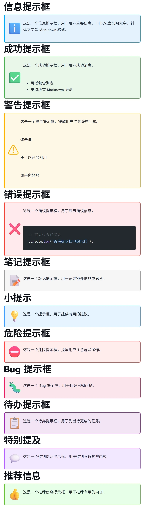

[English](README_EN.md)
# 🎨 Astro Tips - 美观的提示框集成

> 🌟 为 Astro 生态系统打造的提示框集成

**让你的内容更加生动！** `astro-tips` 是一个简单易用的 Astro 集成，只需几行代码就能在 Markdown 和 MDX 文件中创建 16 种精美的提示框。

✨ **核心特性**
- 🚀 零配置即用，开箱即用
- 🎨 16 种内置提示框类型，覆盖所有使用场景
- 🌙 自动适配亮色/暗色主题
- 📝 完全兼容 Markdown 语法
- ✨ 简单直观的使用方式

## 📦 快速安装

选择你喜欢的包管理器：

```bash
# 使用 npm
npm install astro-tips

# 使用 yarn  
yarn add astro-tips

# 使用 pnpm
pnpm add astro-tips

# 使用 bun
bun add astro-tips
```

## ⚙️ 配置设置

### 基础配置（推荐）

在 `astro.config.mjs` 文件中添加集成，享受零配置的便利：

```js
import { defineConfig } from 'astro/config';
import astroTips from 'astro-tips';

export default defineConfig({
  integrations: [astroTips()], // 就这么简单！
});
```

### 高级配置（可选）

可以自定义压缩选项和其他配置：

```js
import { defineConfig } from 'astro/config';
import astroTips from 'astro-tips';

export default defineConfig({
  integrations: [
    astroTips({
      // 开启 CSS 压缩 (默认: true)
      minifyCSS: true,
      
      // 开启 JS 压缩 (默认: true) 
      minifyJS: true,
      
      // 可以添加自定义提示框类型
      customTypes: {
        myTip: {
          icon: '🚀',
          style: {
            light: { background: '#f0f9ff' },
            dark: { background: '#0c1825' },
            border: '#3b82f6'
          }
        }
      }
    })
  ]
});
```

### 配置选项详解

| 选项 | 类型 | 默认值 | 描述 |
|------|------|--------|------|
| `minifyCSS` | `boolean` | `true` | 是否启用 CSS 压缩 |
| `minifyJS` | `boolean` | `true` | 是否启用 JS 压缩 |
| `customTypes` | `object` | `{}` | 自定义提示框类型配置 |

## 🚀 使用方法

### 基础语法

在任何 Markdown 或 MDX 文件中使用以下简单语法：

````markdown
:::类型名
你的内容（支持完整的 Markdown 语法）
:::
````

### 实际示例

````markdown
:::info
💡 **小贴士：** 这是一个信息提示框！

你可以在这里写任何内容：
- **加粗文字** 和 *斜体文字*
- [链接](https://astro.build)
- 甚至代码块：

```javascript
console.log('Hello, Astro Tips!');
```
:::
````

**渲染效果：**



## 🎨 16 种内置样式

我们为你精心设计了 16 种提示框，满足各种使用场景：

### 📝 基础类型
- `tip` 💡 - 实用技巧和建议
- `note` 📝 - 重要备注信息
- `info` ℹ️ - 一般信息说明
- `warning` ⚠️ - 注意事项提醒

### 🚨 状态提醒  
- `success` ✅ - 成功操作反馈
- `error` ❌ - 错误信息提示
- `danger` ⛔ - 危险警告
- `caution` 🔻 - 谨慎提醒

### 💡 特殊用途
- `recommend` 👍 - 推荐内容
- `important` ⭐ - 重要强调
- `example` 🔍 - 示例演示
- `question` ❓ - 问题提出

### 🎯 其他类型
- `answer` ✨ - 问题解答
- `quote` 💭 - 引用内容  
- `mention` 💬 - 特别提及
- `bug` 🐛 - Bug 相关提示

### 使用示例

```markdown
:::tip
💡 这是一个实用技巧提示框！
:::

:::warning
⚠️ 请注意这个重要的警告信息！
:::

:::success
✅ 操作成功完成！
:::

:::error
❌ 发生了一个错误，请检查你的代码。
:::
```


## ✨ 自动检测机制
- 🌞 用户偏好亮色模式 → 使用亮色提示框
- 🌙 用户偏好暗色模式 → 使用暗色提示框  
- 💻 跟随系统设置 → 智能切换

## 🧩 更多使用场景

### 在博客中使用

提示框特别适合在博客文章中突出显示重要信息：

```markdown
:::tip
💡 **作者提示：** 这篇文章需要基础的 HTML 和 CSS 知识。
:::

正文内容...

:::important
⭐ 请注意这个关键概念，它将在后续章节中反复出现。
:::
```

### 在文档中使用

在技术文档中，提示框可以清晰地标注注意事项：

```markdown
### 安装步骤

:::info
ℹ️ 安装前请确保 Node.js 版本 ≥ 16.0.0
:::

安装步骤说明...

:::warning
⚠️ 在生产环境中请不要使用默认配置，这可能会带来安全风险。
:::
```

### 在教程中使用

教程中的提示框可以强调关键步骤：

```markdown
:::success
✅ 恭喜！你已经完成了第一个 Astro 组件的创建。
:::

:::example
📖 **实例：** 以下是一个完整的组件示例
```js
// 示例代码
```
:::

## 🔧 高级用法

### 嵌套内容支持

提示框内可以包含任何 Markdown 内容：

```markdown
:::example
### 代码示例
这里演示如何使用 Astro：

```javascript
// astro.config.mjs
export default defineConfig({
  integrations: [astroTips()]
});
```

还可以包含：
- **列表项目**
- [链接](https://astro.build)
- > 引用内容
:::
```

### 主题自定义

通过 CSS 变量轻松自定义样式：

```css
/* 在你的全局样式文件中 */
:root {
  --astro-tips-tip-bg-light: #f0f9ff;
  --astro-tips-tip-bg-dark: #0c1825;
  --astro-tips-tip-border: #3b82f6;
}
```

### TypeScript 支持

完整的 TypeScript 类型定义：

```typescript
import type { AstroTipsOptions } from 'astro-tips';

const tipsConfig: AstroTipsOptions = {
  minifyCSS: true,
  minifyJS: true,
  customTypes: {
    // 完整的类型提示支持
  }
};
```

## 🛠️ 故障排除

### 常见问题

**Q: 提示框没有显示？**
A: 确保在 `astro.config.mjs` 中正确添加了集成。

**Q: 样式不正确？**
A: 检查是否有 CSS 冲突，尝试清除浏览器缓存。

**Q: 暗色模式不工作？**
A: 确保你的站点支持 `prefers-color-scheme` 媒体查询。

### 调试模式

开启详细日志进行调试：

```js
export default defineConfig({
  integrations: [
    astroTips({
      debug: true // 开启调试模式
    })
  ]
});
```

---

## 📄 开源协议

本项目基于 [MIT 协议](LICENSE) 开源，欢迎自由使用和贡献！

**觉得有用？别忘了给我们一个 ⭐ Star 哦！**
